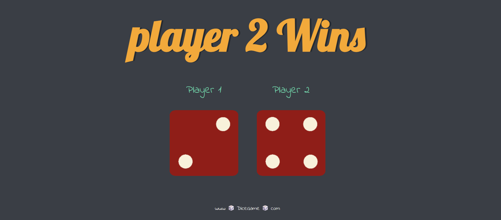
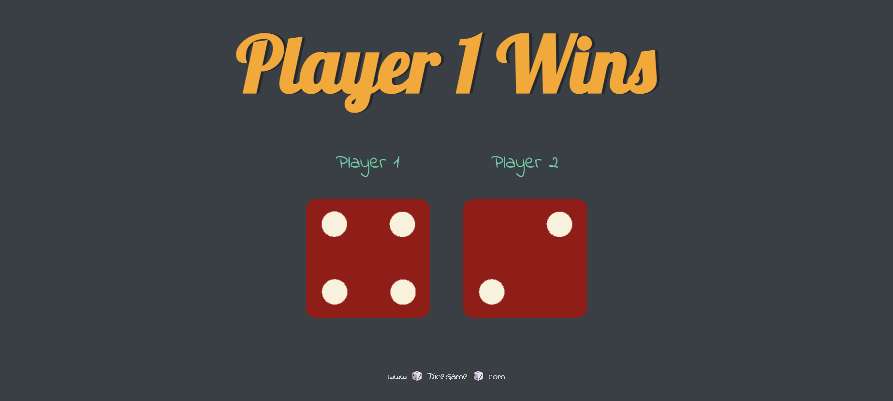

🎲 Dice Game

  

  

A simple JavaScript-based Dice Game where two players roll dice and the highest roll wins. This project demonstrates basic DOM manipulation, event handling, and styling with HTML/CSS/JS.

Features

Roll dice with a button click.

Random dice numbers generated using JavaScript.

Dynamic display of dice images based on the roll.

Shows which player wins after each roll.

Technologies Used

HTML – structure of the game.

CSS – styling the game interface.

JavaScript – game logic and interactivity.

How to Play

Open dicee.html in your browser.

Just Refresh the Page dice will roll.

See the dice values and the winner displayed on the screen.

DiceGame/
├── dicee.html       # Main HTML file
├── styles.css       # Stylesheet
├── new.js           # JavaScript file with game logic
├── utils/           # Dice images (dice1.png to dice6.png)
└── desktop.ini      # System file (can ignore)

Future Improvements

Add player score tracking.

Add animations for dice roll.

Make it responsive for mobile devices.

Author

Shubham Kadbhane
